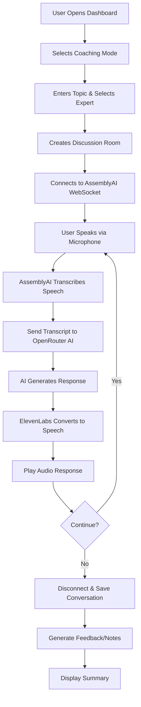
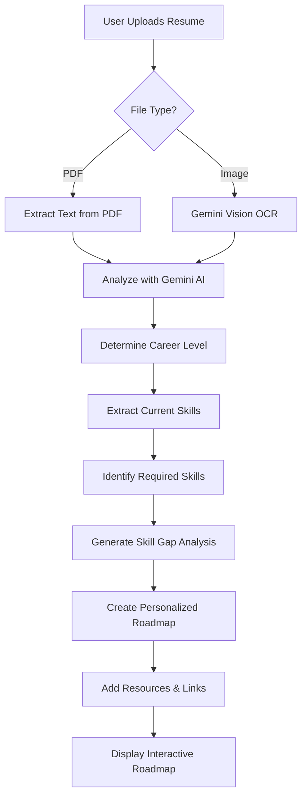
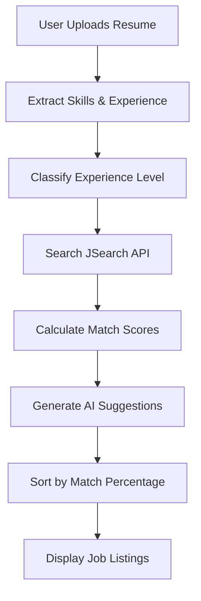

# 🎓 EduHelper - AI-Powered Learning & Career Assistant

> Transform your learning experience with personalized AI coaching, career guidance, and intelligent voice assistance.

[](https://nextjs.org/)
[](https://convex.dev/)
[](LICENSE)

---

## 📋 Table of Contents

- [Overview](#overview)
- [Features](#features)
- [Architecture](#architecture)
- [Tech Stack](#tech-stack)
- [Project Structure](#project-structure)
- [Getting Started](#getting-started)
- [Environment Variables](#environment-variables)
- [Workflow](#workflow)
- [API Routes](#api-routes)
- [Database Schema](#database-schema)
- [Deployment](#deployment)

---

## 🌟 Overview

**EduHelper** is a comprehensive AI-powered platform that combines intelligent learning assistance with career development tools. The platform offers voice-based AI coaching across multiple domains (technical, UPSC, medical, law, languages, etc.), personalized career roadmaps, and AI-driven job matching.

### Key Capabilities

- **🎙️ Voice-Based AI Coaching**: Real-time voice conversations with AI experts across 5 learning modes
- **📊 Career Roadmap Generation**: AI-powered personalized learning paths based on resume analysis
- **💼 Intelligent Job Matching**: Resume-based job recommendations with AI suggestions
- **🌍 Multi-Domain Support**: Technical, competitive exams (UPSC, JEE, NEET), professional fields, languages, and more
- **🔊 Natural Voice Interaction**: Speech-to-text and text-to-speech for immersive learning

---

## ✨ Features

### 1. **Discussion Room** (AI Coaching Sessions)

Interactive voice-based learning sessions with AI coaches across 5 specialized modes:

#### 🎓 Topic Base Lecture
- Structured learning sessions with clear explanations
- Supports any subject: React.js, UPSC Polity, Medical Anatomy, Corporate Law, etc.
- AI provides step-by-step concept breakdowns
- Follow-up questions to reinforce understanding

#### 🎤 Mock Interview
- Realistic interview practice for any field
- Role-relevant questions (technical, UPSC, medical, law, business)
- Brief feedback on demand
- Simulates real interview scenarios

#### 📝 Ques Ans Prep
- Focused Q&A sessions for exam preparation
- Supports competitive exams, certifications, and professional tests
- Constructive feedback on answers
- Pattern analysis and improvement suggestions

#### 🌐 Learn Language
- Language coaching with pronunciation tips
- Practice tasks and useful phrases
- Supports multiple languages (English, Spanish, French, German, etc.)
- Interactive conversational practice

#### 🧘 Meditation
- Guided meditation sessions
- Breathing exercises and mindfulness techniques
- Soothing AI voice guidance
- Structured meditation notes

**Technical Implementation:**
- Real-time speech-to-text using AssemblyAI WebSocket
- AI responses via OpenRouter (Xiaomi Mimo v2 Flash model)
- Text-to-speech using ElevenLabs API
- Conversation history stored in Convex database
- Auto-generated feedback and notes after sessions

---

### 2. **Resume Analysis & Career Roadmap**

Upload your resume and get personalized career guidance:

#### Features:
- **Multi-format Support**: PDF and image (PNG/JPG) resumes
- **AI Text Extraction**: Gemini 2.5 Flash for OCR and text extraction
- **Career Level Detection**: Automatically determines experience level (entry/mid/senior/expert/career-changer)
- **Skill Gap Analysis**: Identifies missing skills for target roles
- **Personalized Roadmaps**: Stage-by-stage learning paths with:
  - Duration estimates
  - Required skills
  - Learning resources (documentation, courses, tutorials)
  - YouTube video links
  - Milestones and checkpoints
- **Feedback Summary**: Strengths, weaknesses, and targeted improvements

**Workflow:**
1. Upload resume (PDF/image)
2. Enter desired role (e.g., "Full Stack Developer", "UPSC Aspirant")
3. AI extracts text and analyzes experience
4. Generates skill-gap focused roadmap
5. View interactive roadmap with resources

---

### 3. **Job Finder**

AI-powered job search and matching:

#### Features:
- **Resume-Based Matching**: Extracts skills and experience from resume
- **Real Job Listings**: Integration with JSearch API for live job postings
- **Match Percentage**: AI calculates compatibility scores
- **AI Application Tips**: Personalized suggestions for each job
- **Career Recommendations**: Gemini-powered advice for Indian job market
- **Experience Level Detection**: Automatic classification (Junior/Mid/Senior)

**Workflow:**
1. Upload resume
2. Enter desired roles (comma-separated)
3. AI extracts skills and experience
4. Fetches matching jobs from India
5. Displays jobs sorted by match percentage
6. Provides AI suggestions for each application

---

## 🏗️ Architecture

### High-Level Architecture

```
┌─────────────────────────────────────────────────────────────┐
│                        Client Layer                          │
│  (Next.js 16 App Router + React 19 + TailwindCSS)          │
└────────────────────┬────────────────────────────────────────┘
                     │
                     ├─── Authentication (Stack Auth)
                     │
                     ├─── UI Components (shadcn/ui + Radix UI)
                     │
                     ▼
┌─────────────────────────────────────────────────────────────┐
│                      API Layer (Next.js)                     │
│  ┌──────────────┬──────────────────┬───────────────────┐   │
│  │ /api/        │ /api/            │ /api/             │   │
│  │ analyze-     │ job-resume       │ getToken          │   │
│  │ resume       │                  │ (AssemblyAI)      │   │
│  └──────────────┴──────────────────┴───────────────────┘   │
└────────────────────┬────────────────────────────────────────┘
                     │
                     ▼
┌─────────────────────────────────────────────────────────────┐
│                    Service Layer                             │
│  ┌──────────────────────────────────────────────────────┐  │
│  │ GlobalServices.jsx                                    │  │
│  │  - AIModel (OpenRouter - Xiaomi Mimo v2)            │  │
│  │  - ConvertTextToSpeech (ElevenLabs)                 │  │
│  │  - AIModelToGenerateFeedbackAndNotes                │  │
│  └──────────────────────────────────────────────────────┘  │
└────────────────────┬────────────────────────────────────────┘
                     │
                     ▼
┌─────────────────────────────────────────────────────────────┐
│                   External AI Services                       │
│  ┌────────────┬──────────────┬──────────────┬───────────┐  │
│  │ OpenRouter │ Gemini API   │ AssemblyAI   │ ElevenLabs│  │
│  │ (Xiaomi    │ (2.5 Flash)  │ (STT)        │ (TTS)     │  │
│  │  Mimo)     │              │              │           │  │
│  └────────────┴──────────────┴──────────────┴───────────┘  │
└─────────────────────────────────────────────────────────────┘
                     │
                     ▼
┌─────────────────────────────────────────────────────────────┐
│                  Database Layer (Convex)                     │
│  ┌──────────────────────────────────────────────────────┐  │
│  │ Tables:                                               │  │
│  │  - users (name, email, credits, subscriptionId)      │  │
│  │  - DiscussionRoom (topic, coachingOption,            │  │
│  │    expertName, conversation, summary, uid)           │  │
│  └──────────────────────────────────────────────────────┘  │
└─────────────────────────────────────────────────────────────┘
```

---

## 🛠️ Tech Stack

### Frontend
- **Framework**: Next.js 16 (App Router)
- **UI Library**: React 19
- **Styling**: TailwindCSS 4 + shadcn/ui components
- **UI Components**: Radix UI primitives
- **Animations**: Framer Motion, TailwindCSS Animate
- **Forms**: React Hook Form + Zod validation
- **Markdown**: React Markdown
- **Charts**: Recharts
- **Icons**: Lucide React

### Backend & Database
- **Backend**: Convex (serverless backend)
- **Authentication**: Stack Auth (@stackframe/stack)
- **Database**: Convex (real-time database)

### AI & ML Services
- **Primary AI**: OpenRouter API (Xiaomi Mimo v2 Flash model)
- **Resume Analysis**: Google Gemini 2.5 Flash Preview
- **Speech-to-Text**: AssemblyAI (real-time WebSocket)
- **Text-to-Speech**: ElevenLabs API
- **Job Search**: JSearch API (RapidAPI)

### Development Tools
- **Language**: JavaScript (JSX)
- **Package Manager**: npm
- **Audio Recording**: RecordRTC
- **Webcam**: react-webcam
- **HTTP Client**: Axios
- **Toast Notifications**: Sonner

---

## 📁 Project Structure

```
ai-mock-interview/
├── app/                          # Next.js App Router
│   ├── (main)/                   # Main application routes
│   │   ├── dashboard/            # Dashboard page
│   │   │   └── _components/      # Dashboard components
│   │   │       ├── FeatureAssistants.jsx
│   │   │       ├── Feedback.jsx
│   │   │       ├── History.jsx
│   │   │       └── UserInputDialog.jsx
│   │   ├── discussion-room/      # Voice coaching sessions
│   │   │   └── [roomid]/
│   │   │       ├── page.jsx      # Discussion room UI
│   │   │       └── _components/
│   │   │           └── ChatBox.jsx
│   │   ├── roadmap/              # Career roadmap viewer
│   │   ├── jobs/                 # Job finder
│   │   └── view-summary/         # Session summaries
│   ├── api/                      # API routes
│   │   ├── analyze-resume/       # Resume analysis endpoint
│   │   ├── job-resume/           # Job matching endpoint
│   │   └── getToken/             # AssemblyAI token
│   ├── _context/                 # React Context
│   │   └── UserContext.jsx
│   ├── layout.js                 # Root layout
│   ├── page.js                   # Landing page
│   └── globals.css               # Global styles
├── components/                   # Reusable UI components
│   └── ui/                       # shadcn/ui components
├── convex/                       # Convex backend
│   ├── schema.js                 # Database schema
│   ├── DiscussionRoom.jsx        # Discussion room mutations/queries
│   ├── users.js                  # User mutations/queries
│   └── _generated/               # Auto-generated Convex files
├── services/                     # Business logic
│   ├── GlobalServices.jsx        # AI service integrations
│   ├── Options.jsx               # Coaching mode definitions
│   └── TopicSuggestions.jsx      # Topic category suggestions
├── lib/                          # Utility functions
├── public/                       # Static assets
├── stack/                        # Stack Auth configuration
├── .env.local                    # Environment variables
├── package.json                  # Dependencies
├── next.config.mjs               # Next.js configuration
└── README.md                     # This file
```

---

## 🚀 Getting Started

### Prerequisites

- **Node.js**: v18+ 
- **npm**: v9+
- **Convex Account**: [Sign up at convex.dev](https://convex.dev)
- **API Keys**: See [Environment Variables](#environment-variables)

### Installation

1. **Clone the repository**
   ```bash
   git clone <repository-url>
   cd ai-mock-interview
   ```

2. **Install dependencies**
   ```bash
   npm install
   ```

3. **Set up environment variables**
   
   Create a `.env.local` file in the root directory:
   ```bash
   cp .env.example .env.local
   ```
   
   Fill in the required API keys (see [Environment Variables](#environment-variables))

4. **Initialize Convex**
   ```bash
   npx convex dev
   ```
   
   This will:
   - Create a new Convex project (if needed)
   - Deploy your schema and functions
   - Start the Convex development server

5. **Run the development server**
   ```bash
   npm run dev
   ```

6. **Open the application**
   
   Navigate to [http://localhost:3000](http://localhost:3000)

---

## 🔐 Environment Variables

Create a `.env.local` file with the following variables:

```bash
# Convex
CONVEX_DEPLOYMENT=<your-convex-deployment-url>
NEXT_PUBLIC_CONVEX_URL=<your-convex-url>

# Stack Auth (Authentication)
NEXT_PUBLIC_STACK_PROJECT_ID=<your-stack-project-id>
NEXT_PUBLIC_STACK_PUBLISHABLE_CLIENT_KEY=<your-stack-key>

# OpenRouter AI (Primary AI Model)
NEXT_PUBLIC_OPENROUTER_API_KEY=<your-openrouter-api-key>

# Google Gemini API (Resume Analysis)
GEMINI_API_KEY=<your-gemini-api-key>

# AssemblyAI (Speech-to-Text)
ASSEMBLYAI_API_KEY=<your-assemblyai-api-key>

# ElevenLabs (Text-to-Speech)
NEXT_PUBLIC_ELEVENLABS_API_KEY=<your-elevenlabs-api-key>

# JSearch API (Job Search) - Optional
JSEARCH_API_KEY=<your-jsearch-rapidapi-key>
```

### How to Get API Keys

1. **Convex**: [convex.dev](https://convex.dev) - Free tier available
2. **Stack Auth**: [stack-auth.com](https://stack-auth.com) - Free tier available
3. **OpenRouter**: [openrouter.ai](https://openrouter.ai) - Pay-per-use, free models available
4. **Gemini API**: [ai.google.dev](https://ai.google.dev) - Free tier available
5. **AssemblyAI**: [assemblyai.com](https://www.assemblyai.com) - Free tier available
6. **ElevenLabs**: [elevenlabs.io](https://elevenlabs.io) - Free tier available
7. **JSearch**: [rapidapi.com/letscrape-6bRBa3QguO5/api/jsearch](https://rapidapi.com/letscrape-6bRBa3QguO5/api/jsearch) - Freemium

---

## 🔄 Workflow

### Discussion Room Workflow



### Resume Analysis Workflow



### Job Finder Workflow



---

## 🌐 API Routes

### 1. `/api/analyze-resume` (POST)

Analyzes resume and generates career roadmap.

**Request:**
```javascript
FormData {
  resume: File (PDF or PNG/JPG),
  desiredRole: string
}
```

**Response:**
```json
{
  "feedback": {
    "currentLevel": "mid_level",
    "strengths": ["..."],
    "improvements": ["..."],
    "technicalSkills": ["..."],
    "recommendations": ["..."]
  },
  "roadmap": {
    "title": "Personalized Career Path to Full Stack Developer",
    "currentLevel": "mid_level",
    "targetRole": "Full Stack Developer",
    "stages": [
      {
        "id": "stage_1",
        "title": "Fill Specialized Skill Gaps",
        "duration": "2-3 months",
        "skills": ["..."],
        "resources": ["..."],
        "resourceLinks": [...],
        "youtubeLinks": [...],
        "milestones": ["..."],
        "order": 1
      }
    ]
  }
}
```

### 2. `/api/job-resume` (POST)

Finds matching jobs based on resume.

**Request:**
```javascript
FormData {
  resume: File (PDF or PNG/JPG),
  desiredRole: string
}
```

**Response:**
```json
{
  "experienceLevel": "Mid-level",
  "yearsOfExperience": "3",
  "skills": ["JavaScript", "React", "Node.js"],
  "matchScores": {
    "Full Stack Developer": 85
  },
  "jobs": [
    {
      "title": "Full Stack Engineer",
      "company": "Tech Company",
      "description": "...",
      "location": "Mumbai, Maharashtra",
      "salary": "₹800,000 - ₹1,200,000",
      "type": "Full-time",
      "experience": "3+ years",
      "requiredSkills": ["..."],
      "link": "https://...",
      "matchPercentage": 85,
      "aiSuggestion": "Highlight your React expertise..."
    }
  ],
  "recommendations": ["..."]
}
```

### 3. `/api/getToken` (GET)

Generates AssemblyAI temporary token for WebSocket connection.

**Response:**
```json
{
  "token": "eyJ..."
}
```

---

## 🗄️ Database Schema

### Convex Schema

```javascript
// convex/schema.js

users: {
  name: string,
  email: string,
  credits: number,
  subscriptionId?: string
}

DiscussionRoom: {
  coachingOption: string,        // "Mock Interview", "Topic Base Lecture", etc.
  topic: string,                 // User-entered topic
  expertName: string,            // ElevenLabs voice ID
  conversation?: any,            // Array of {role, content} messages
  summary?: any,                 // AI-generated feedback/notes
  uid?: Id<"users">             // Reference to user
}
```

### Convex Functions

**Mutations:**
- `CreateNewRoom`: Creates a new discussion room
- `UpdateConversation`: Saves conversation history
- `UpdateSummary`: Saves AI-generated feedback
- `UpdateUserToken`: Updates user credits

**Queries:**
- `GetDiscussionRoom`: Fetches room by ID
- `GetAllDiscussionRoom`: Fetches all rooms for a user
- `GetUser`: Fetches user by email

---

## 🎨 Key Features Implementation

### 1. Real-Time Voice Interaction

**Technologies:**
- **RecordRTC**: Browser audio recording
- **AssemblyAI WebSocket**: Real-time speech-to-text
- **OpenRouter API**: AI response generation
- **ElevenLabs API**: Text-to-speech conversion

**Flow:**
1. User clicks "Connect" → Requests microphone access
2. RecordRTC captures audio in 250ms chunks
3. Audio sent to AssemblyAI WebSocket
4. AssemblyAI returns transcript on "end of turn"
5. Transcript sent to OpenRouter AI (Xiaomi Mimo v2)
6. AI response converted to speech via ElevenLabs
7. Audio plays automatically

### 2. Multi-Format Resume Processing

**PDF Processing:**
- Basic text extraction using buffer parsing
- Searches for text between BT/ET tags
- Fallback to raw buffer string extraction

**Image Processing:**
- Gemini 2.5 Flash Vision API
- Base64 image encoding
- OCR with prompt: "Extract all text from this resume image"

### 3. Intelligent Roadmap Generation

**Process:**
1. **Level Detection**: Analyzes resume to determine career stage
2. **Skill Extraction**: Identifies current technical skills
3. **Gap Analysis**: Compares current vs. required skills
4. **Stage Generation**: Creates 2-6 stages based on level
5. **Resource Curation**: Adds real URLs for courses, docs, videos
6. **Milestone Definition**: Sets achievable checkpoints

**Roadmap Stages by Level:**
- **Entry Level**: 5 stages (fundamentals → first job)
- **Mid Level**: 4 stages (advanced skills → role transition)
- **Senior Level**: 3 stages (domain mastery → leadership)
- **Expert Level**: 2 stages (specialization → thought leadership)
- **Career Changer**: 6 stages (foundations → successful transition)

---

## 📦 Deployment

### Deploying to Vercel

1. **Push to GitHub**
   ```bash
   git add .
   git commit -m "Initial commit"
   git push origin main
   ```

2. **Connect to Vercel**
   - Go to [vercel.com](https://vercel.com)
   - Import your GitHub repository
   - Configure environment variables
   - Deploy

3. **Deploy Convex**
   ```bash
   npm run deploy
   ```

### Environment Variables on Vercel

Add all environment variables from `.env.local` to Vercel:
- Project Settings → Environment Variables
- Add each key-value pair
- Redeploy after adding variables

---

## 🤝 Contributing

Contributions are welcome! Please follow these steps:

1. Fork the repository
2. Create a feature branch (`git checkout -b feature/amazing-feature`)
3. Commit your changes (`git commit -m 'Add amazing feature'`)
4. Push to the branch (`git push origin feature/amazing-feature`)
5. Open a Pull Request

---

## 📄 License

This project is licensed under the MIT License - see the [LICENSE](LICENSE) file for details.

---

## 🙏 Acknowledgments

- **Next.js Team** for the amazing framework
- **Convex** for the serverless backend
- **OpenRouter** for AI model access
- **Google Gemini** for powerful AI capabilities
- **AssemblyAI** for real-time speech recognition
- **ElevenLabs** for natural voice synthesis
- **shadcn/ui** for beautiful UI components

---

## 📞 Support

For support, email support@eduhelper.com or open an issue on GitHub.

---

**Made with ❤️ by the EduHelper Team**
